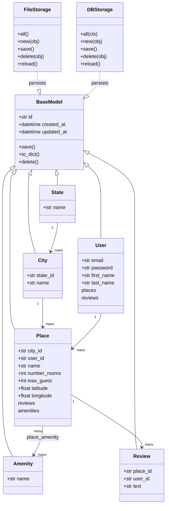

# AirBnB Clone v2

The second iteration of the ALX/Holberton AirBnB clone project. It builds on the original command-line console and file-based persistence by adding a SQLAlchemy-backed database storage engine, so the same object model can be persisted either to a JSON flat file or to a MySQL database, selected at runtime via environment variables.

  

> This repository started as a fork of [justinmajetich/AirBnB_clone](https://github.com/justinmajetich/AirBnB_clone) for a Holberton/ALX group project and was extended independently with additional storage and model work.

## Features

- Interactive `cmd`-based console (`console.py`) supporting both space-separated and dotted (`User.create(...)`) command syntax
- Dual storage backends selected via the `HBNB_TYPE_STORAGE` environment variable:
  - `FileStorage` — serializes objects to a local `file.json`
  - `DBStorage` — persists objects to MySQL using SQLAlchemy ORM models and relationships
- SQLAlchemy declarative models for `User`, `State`, `City`, `Amenity`, `Place`, and `Review`, including foreign keys and a `place_amenity` many-to-many association table
- `create`, `show`, `all`, `update`, `destroy`, and `count` commands for every model class
- Static front-end mockups (`web_static/`) showing progressive HTML/CSS versions of the listing page
- Unit tests covering models and the storage engine (`tests/`)
- SQL setup scripts (`setup_mysql_dev.sql`, `setup_mysql_test.sql`) for provisioning dev/test databases

## Tech Stack

- Python 3 (`cmd`, `uuid`, `json`, `datetime`)
- SQLAlchemy ORM
- MySQL (via `mysqlclient` / `mysqldb` driver)
- HTML5 / CSS3 (static front-end prototypes)
- `unittest` for automated testing

## Project Structure

```
console.py                     Entry point: the HBNBCommand interactive shell
models/base_model.py           BaseModel: shared id/timestamps, SQLAlchemy Base, to_dict/save/delete
models/user.py                  User model (SQLAlchemy table "users")
models/state.py                 State model
models/city.py                  City model
models/amenity.py               Amenity model
models/place.py                 Place model, with place_amenity association table
models/review.py                Review model
models/engine/file_storage.py  FileStorage: JSON persistence engine
models/engine/db_storage.py    DBStorage: SQLAlchemy/MySQL persistence engine
setup_mysql_dev.sql             Dev database/user setup script
setup_mysql_test.sql            Test database/user setup script
web_static/                     Static HTML/CSS prototypes of the front end
tests/                           Unit tests for models and storage engines
```

## Architecture

`BaseModel` now doubles as a SQLAlchemy mixin (paired with `Base`), so every model class is both a plain Python object and a database-mapped entity. Storage is abstracted behind a common interface (`all`, `new`, `save`, `delete`, `reload`) implemented by two interchangeable engines.



## Installation

```bash
git clone https://github.com/OmarElzero/AirBnB_clone_v2.git
cd AirBnB_clone_v2
pip3 install sqlalchemy mysqlclient
```

For MySQL storage, provision the database first:

```bash
cat setup_mysql_dev.sql | mysql -hlocalhost -uroot -p
```

## Usage

Run with file storage (default):

```bash
./console.py
```

Run with MySQL database storage:

```bash
HBNB_MYSQL_USER=hbnb_dev \
HBNB_MYSQL_PWD=hbnb_dev_pwd \
HBNB_MYSQL_HOST=localhost \
HBNB_MYSQL_DB=hbnb_dev_db \
HBNB_TYPE_STORAGE=db \
HBNB_ENV=dev \
./console.py
```

Example session:

```
(hbnb) create User email="test@test.com" password="pwd" first_name="John" last_name="Doe"
49faff9a-6318-451f-87b6-910505c55907
(hbnb) all User
["[User] (49faff9a-6318-451f-87b6-910505c55907) {...}"]
(hbnb) User.count()
1
```

## Demo

No live demo is available for this project.

## Testing

```bash
python3 -m unittest discover tests
```

---

**Author:** OmarElzero · [GitHub](https://github.com/OmarElzero)
_Last updated: 2026-08-23_
